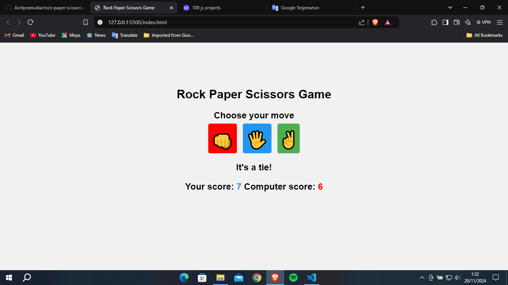

# Rock Paper Scissors Game Project
 

<b>Tech Stack</b>
1. HTML
2. CSS
3. JavaScript
 

### Description
Rock-Paper-Scissors is a two-player hand game. It is often used for random selection, such as coin tossing, dice, etc. Some games and sports use it to determine which participant goes first. It is also sometimes used to determine roles in role-playing games, or as a form of gambling. It is played in many parts of the world.

 

### Preview

